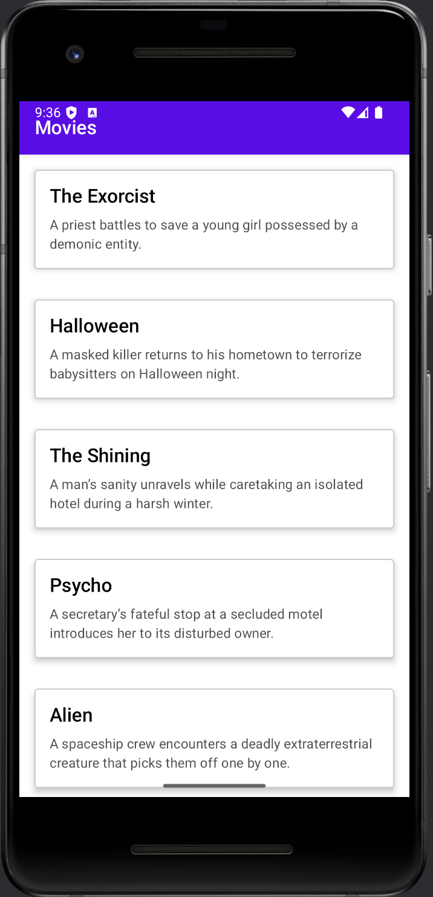

# IMDB Movies – Kotlin & Jetpack Compose

IMDB Movies is a modern Android application written in Kotlin and Jetpack Compose that lets you browse, search, and view details for movies. It follows a clean MVVM architecture with Retrofit for networking, Coil for image loading, Hilt for dependency injection, and Coroutines/Flow for asynchronous data handling.

## Features
- **Browse Popular & Top-Rated Movies** fetched from a public movie API
- **Search** movies by title with live suggestions
- **Movie Detail** screen showing poster, synopsis, rating, release date, genres, and cast
- **Dark & Light Theme** support, following system setting
- **Offline Caching** of recently viewed movie details (via Room or in-memory cache)
- **Pull-to-Refresh** on lists

## Architecture & Tech Stack
- **Language:** Kotlin
- **UI:** Jetpack Compose (with Material3 components)
- **Architecture:** MVVM (ViewModel + Repository)
- **Dependency Injection:** Hilt
- **Networking:** Retrofit 2 + Gson converter
- **Image Loading:** Coil
- **Asynchronous:** Kotlin Coroutines & Flow
- **Persistence (optional):** Room or simple in-memory cache  

## Screenshots
   
 